# JPA 양방향 순환참조

커널360에서 스프링부트와 JPA로 개발을 하면서 겪었던 **2가지 양방향 순환참조 문제**를 트러블 슈팅 - 해결의 형식으로 소개드리려고합니다.

---
## 🧩 1: Service 클래스간의 양방향 순환참조

### 🚨 문제 상황
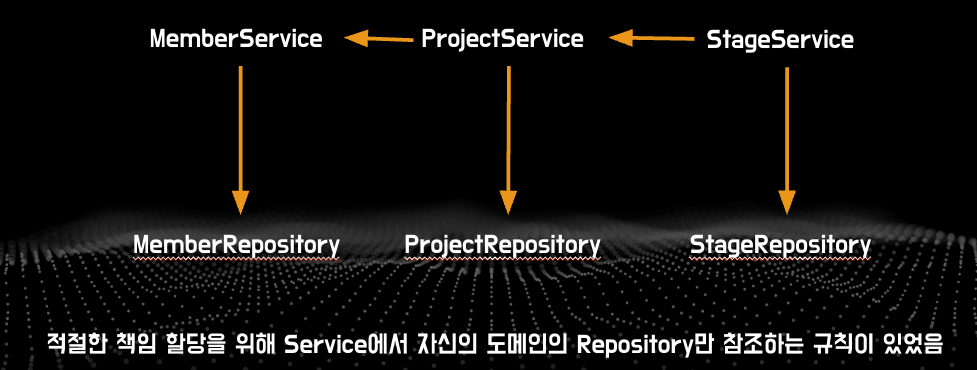
기존에 변경에 용이한 코드, 시스템을 만들기 위해 객체에 적절한 책임을 위임하는 방식으로 코드를 작성하고 있었다. 
이를 실현하기 위한 방법, 규칙 중 하나로 각 Service에서 자신의 도메인의 Repository만 참조하는 규칙을 팀 전체적으로 적용중이었다. 예를 들어, StageService에서 특정 Project의 Stage를 모두 조회하기 위해 ProjectRepository가 필요하면 바로 참조하는 것이 아니라 ProjectService에게 그 책임을 위임하고 
ProjectService를 통해서만 캡슐화된 상태에서 ProjectRepository에 간접적으로 접근하는 방식으로 규칙을 적용중이었다.

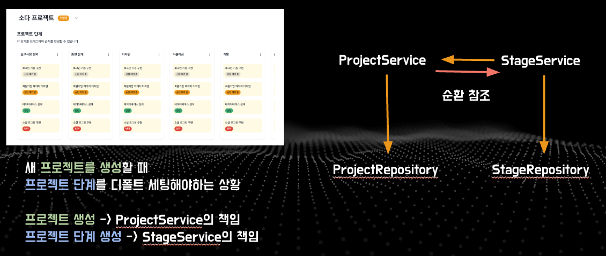
그러나 문제는 위 사진, 아래와 같은 상황에서 발생하였다.
- 프로젝트 생성 시, 디폴트 단계(`Stage`)도 함께 생성되어야 함
- 프로젝트 생성은 `ProjectService`의 책임
- 디폴트 단계 생성을 위해서는 `StageService` 호출이 필요
- 그런데 기존에 `StageService`에서 `ProjectService`를 참조하고 있어 **순환 참조 오류** 발생


### ✅ 해결 방법
1. **임시 해결책**:


   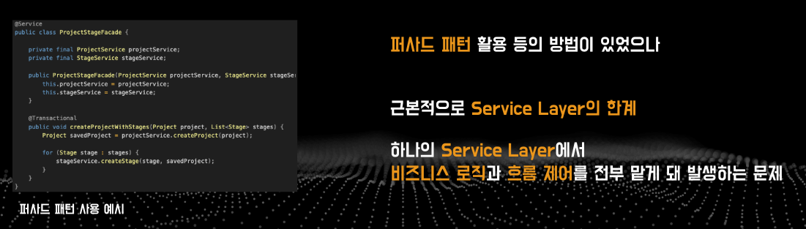
   이를 해결하기 위해 `ProjectService`와 `StageService`위에 `ProjectStageFacade`라는 퍼사드를 만들어 흐름을 제어하게하는 방법이 있었으나 이는 응급처치의 느낌이 강했다.

멘토링과 구글링 결과, 근본적으로 스프링에서 사용하는 3tier layered architecture(Controller-Service-Repository)에서 Service 레이어에 책임이 과하게 할당되어있다는 문제로 판단하여 Service Layer의 부담을 더는 방향으로 리팩토링을 진행하였다.


2. **근본적 해결책**:

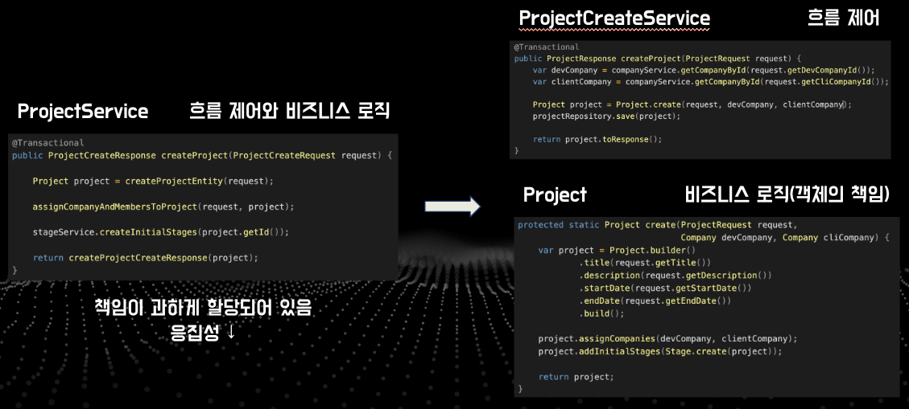
   `Service Layer`에 집중된 책임을 **Domain(Entity)** 중심으로 재배치

### 🔨 리팩토링 결과
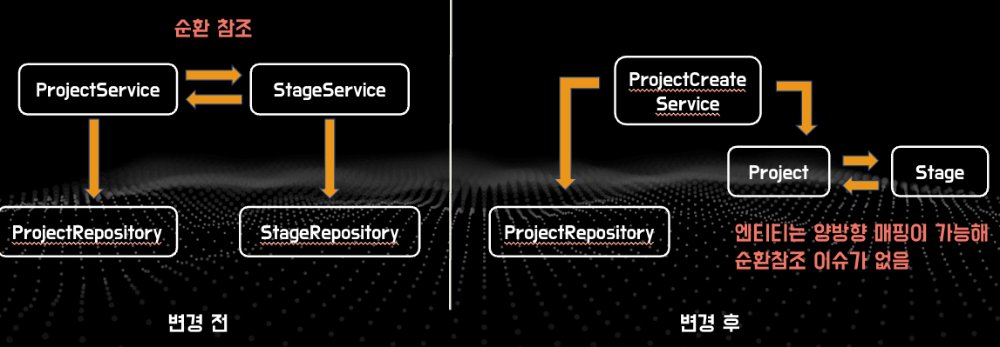
- `ProjectService` → `ProjectCreateService`로 책임 분리
- `ProjectCreateService`에서:
  - `Project`에게 "생성" 메세지 전달
  - `ProjectRepository`에 영속화 요청
- `Project` 내부에서:
  - 본인 생성
  - `Company`, `Member` 할당
  - `Stage`에게 디폴트 단계 생성 요청

→ **Service ↔ Service 간 메시지 전달 구조**를  
→ **Entity ↔ Entity 간 메시지 전달 구조**로 변경

### 💡 의의

기존에 OOP를 공부하는데 실제 스프링에서 어떻게 적용해야할지 고민이 있었는데, 엔티티에게 기존에 객체의 책임에 해당하는 것들을 위임하는 방식으로 명쾌하게 해결되었다.
양방향 문제도해결되고, OOP에서 말하는 자율적인 객체로서 엔티티가 기능하게 된 것이다.
Service가 아닌 도메인 객체가 비즈니스 흐름의 주체가 되며, **캡슐화 강화**, **응집도 향상**, **결합도 감소**하여 유지보수와 변경에 유리한 구조를 갖추게 되었다.


---

## 🧩 2: 로깅 시 양방향 순환참조 문제

### 🚨 문제 상황
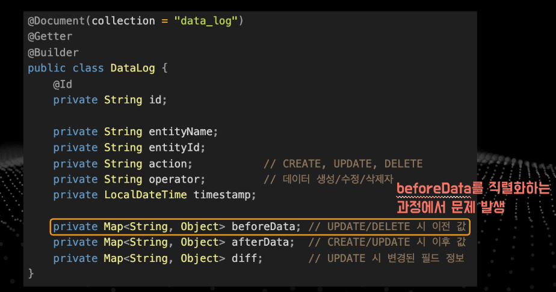
`SODA`에서는 `CREATE`, `UPDATE`, `DELETE` 동작 시  
`beforeData`, `afterData`를 JSON으로 직렬화해 MongoDB에 저장중이다.

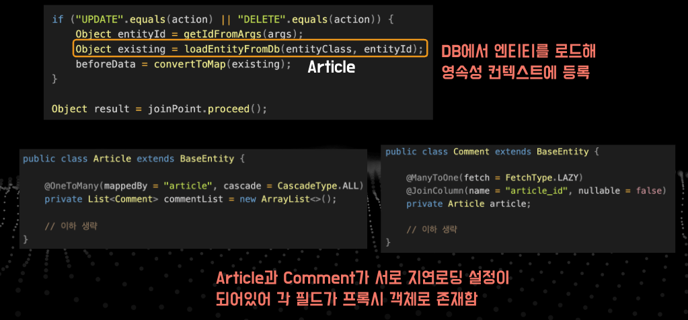
문제 상황을 이해하려면 코드를 조금 이해해야한다.

위 사진은 로깅AOP의 코드 일부이다.

사진 상단의 코드 덩어리를 보면 beforeData를 로깅하기 위해 먼저 DB에서 엔티티를 로드해온다. 이 때, JPA에서는 DB에서 엔티티를 처음 로드해오면 영속성 컨텍스트에 등록한다.

그러나 사진 하단의 Article과 Comment 엔티티를 보면 서로 연관관계를 맺고 있고 "지연로딩"설정이 되어있다.

예를 들어 Article을 DB에서 로드해오고 이를 직렬화한다고 해보자.


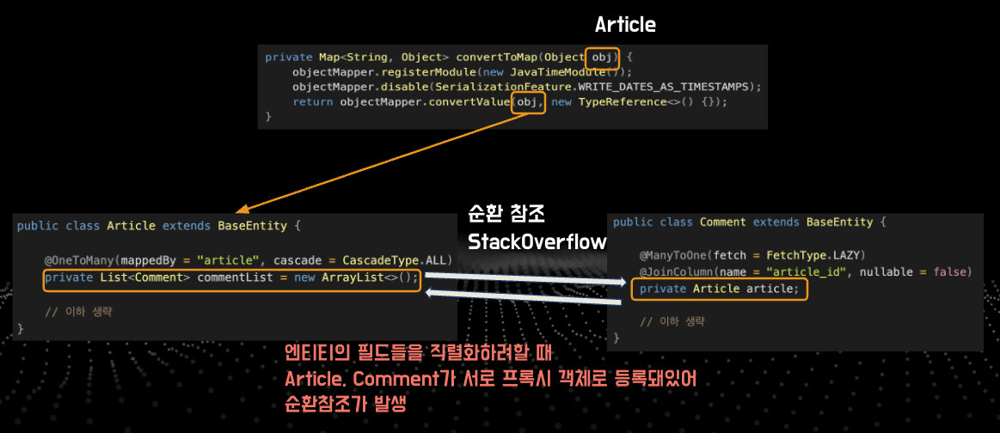
Article을 직렬화할 때 Article의 모든 필드에 접근하는데 이 때 Comment가 지연로딩 설정이 되어있기 때문에 DB에서 로드해서 처음 영속성 컨텍스트에 등록된 상태에서는 commentList가 프록시 객체로 존재한다. 따라서 Comment엔티티를 참조하게 되는데 이 때, Comment의 Article필드도 마찬가지로 지연로딩 설정이 되어있기 때문에 프록시 객체로 존재하게 된다.

즉 프록시 객체가 서로를 계속해서 참조하여 결국 StackOverflow가 발생해 프로그램이 멈추게 된다.

### 🛠️ 해결 방법
#### 1. ObjectMapper 설정 + @JsonIgnore
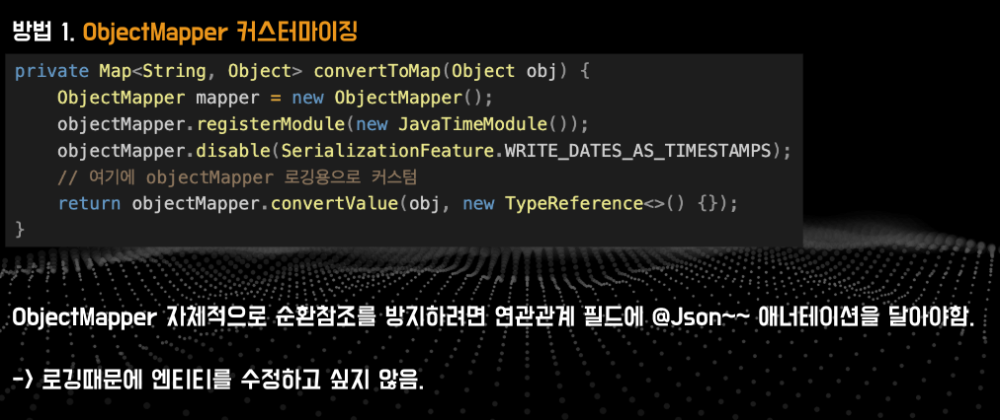
이를 해결하기 위해 첫번째로 떠올렸던 방법은 ObjectMapper를 커스터마이징하여 자체적으로 순환참조를 방지하는 방법이었다. 그러나 ObjectMapper가 그 자체로 순환참조를 인지하는 방법은 존재하지 않고 엔티티의 지연로딩 설정돼있는 연관관계 필드에 @Json 애너테이션을 달아야한다.

예를 들어, 유명한 방법 중 하나인(김영한님의 강의에 소개된다) @JsonIgnore과 Hibernate5를 이용하는 방법이다. 양방향 관계가 있는 두 엔티티중 하나에 연관관계 필드에 @JsonIgnore를 걸어 직렬화하지 않게 하고, 반대방향의 엔티티의 연관관계 필드를 직렬화 할 때 프록시 객체여서 null로  null로 직렬화되는 것을 방지하기 위해 Hibernate5에서 아래 설정을 주는 방법으로 순환참조를 방지할 수 있다.

```java
hibernate5Module.configure(Hibernate5Module.Feature.FORCE_LAZY_LOADING, true);
```
위 방법은 김영한님 강의에서 엔티티의 스펙을 노출하기 때문에 권장하지 않는 방식으로 소개된다. 그러나 지금 상황은 엔티티를 클라이언트나 다른 메서드에 노출하는 상황은 아니기 때문에 김영한님 강의에서 비권장하던 맥락과는 달라 사용을 고려해볼만 하다.

이 방법 외에도 `@JsonManagedReference` / `@JsonBackReference`, `@JsonIdentityInfo` 등 사용할 수 있는 애너테이션이 다양하다.

하지만 로깅때문에 엔티티의 필드에 애너테이션을 달기에는 닭 잡는데 소 잡는 칼을 쓰는 꼴이다.

#### 2. 엔티티 → DTO 변환 후 직렬화
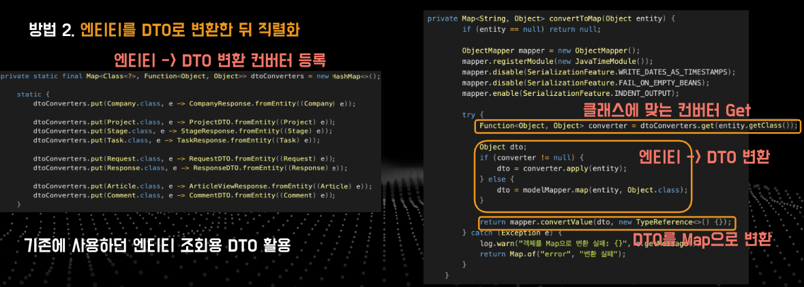
엔티티에 Json애너테이션을 달기 싫어 두 번째 방법, 엔티티를 DTO로 변환하고 이를 직렬화하는 방법을 사용하였다.

기존에 사용하던 엔티티 조회용 DTO를 활용하여서 엔티티를 DTO로 변환하는 컨버터를 등록하고 이를 활용해 beforeData를 로깅할 때 DB에서 로드해온 데이터를 먼저 컨버터로 DTO로 변환한 뒤 이를 직렬화하는 방식이다. DTO에서는 프록시객체로 존재한다거나 하는 이슈가 없고 한쪽에서 id를 저장한다거나 하는 방식으로 설계가 되었기 때문에 순환참조 문제가 발생하지 않는다.

그러나 afterData는 비즈니스 메서드의 반환값(예: `ArticleUpdateResponse`)을 직렬화하기 때문에, 조회용 응답 DTO와 생성/수정용 응답 DTO 필드가 맞지 않으면 데이터 정합성에 문제가 생긴다. 따라서 프로그래머가 DTO를 생성할 때 필드를 맞추려고 노력하거나, 따로 로깅용 DTO를 만들어야한다. 그러나 프로그래머가 관리할 코드가 많아지거나 생각해야할 거리가 많아지면 좋은 설계 방향이 아닌 것 같다.


#### 3. **MixIn 패턴 활용 (선택 예정)**
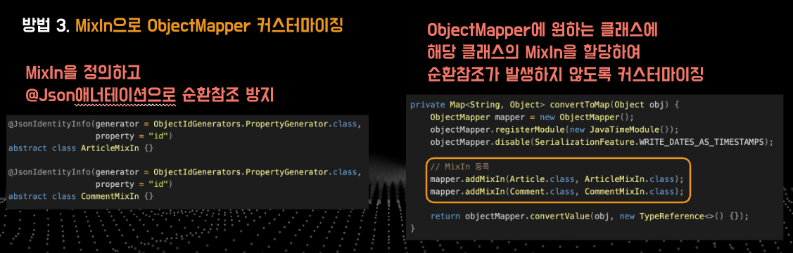
- ObjectMapper 커스터마이징
- 엔티티 클래스에 애너테이션을 직접 달지 않고,  
  외부에서 별도로 정의한 MixIn 클래스에 `@JsonIgnore`, `@JsonIdentityInfo` 등 부여
- `mapper.addMixIn(Article.class, ArticleMixIn.class)` 와 같은 방식

따라서 마지막 방법 MixIn패턴을 활용해 ObjectMapper를 커스터마이징하는 방법이다.

위 방법을 활용하면 엔티티의 필드에 @Json애너테이션을 달지 않고, DTO를 사용하지 않으면서 엔티티를 로깅할 수 있다. 

순환참조 이슈가 발생하는 엔티티의 MixIn을 정의하고 MixIn에 @Json애너테이션을 단 뒤, 
ObjectMapper에 엔티티 클래스와 MixIn을 매핑하면 순환참조가 발생하지 않는다. 

놀랍다! 아직 위 방법은 적용해보지 않았다. 
차후 적용해보고 실제로 작동을 하는지, 어떤 단점이 있는지를 분석하고 본 글을 업데이트하겠다.
---

## ✍️ 마무리

2가지 양방향 순환 참조가 발생하는 상황과 그 해결방법에 대해 살펴보았다.
1. 서비스 클래스간 양방향 참조
2. 양방향 매핑이 있는 엔티티를 직접적으로 직렬화할 때의 양방향 순환 참조

첫번째 양방향 참조는 서비스간의 양방향 참조를 엔티티 필드로 내리는 방식으로 해결하였고,
두번째 양방향 참조는 엔티티를 직접 직렬화하지 않고 DTO(DTO에서 한 쪽 방향으로의 참조를 제거)로 변환한 뒤 직렬화하는 방식으로 해결하였다.

이 방법이 최적은 아니다. 각자의 시스템, 상황에 맞게 각 방법의 장단점을 분석하고 선택하여야한다.

설계는 트레이드 오프의 산물이다. 

어떤 이슈에 대해 다양한 방법을 떠올리고 해당 방법의 장단점을 분석한 뒤 적절히 선택할 줄 아는게 유능한 백엔드 개발자의 역할 중 하나인 것 같다. 

이 쯤에서 글을 마무리한다.
