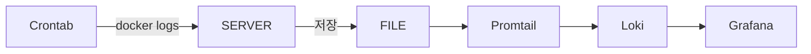

[//]: # (### 시작)

[//]: # (> 앱의 로그를 파일로 관리하라는 피드백을 받았습니다.)

[//]: # (>)

[//]: # (> 현재 애플리케이션을 도커에서 실행중이기 때문에 도커 외부에 저장해야합니다.)

[//]: # (>)

[//]: # (> 왜냐면 컨테이너의 데이터는 휘발성이니까요)

[//]: # (>)

[//]: # (> 앱 내부에서 파일로 저장하는게 더 좋은 방법인 것 같지만 이걸 할 당시에는 내부에서는 저장하지 않고 있었어요)

[//]: # (>)

[//]: # (> 서버에 들어가지 않고 로그를 확인할 수 있는 수단이 필요했기 때문에 일단 crontab과 shell 스크립트를 사용해서 로그를 저장하기로 했습니다.)

[//]: # ()
[//]: # (- 구현 목표)

[//]: # (  - 1분마다 한 번씩 로그를 출력하고 저장)

[//]: # (  - 이전에 있는 로그와 중복되지 않도록 한다.)

[//]: # (  - 로그는 하루에 한번 다른 파일로 교체한다.)

[//]: # (  - 로그가 없으면 저장하지 않는다.)

[//]: # ()
[//]: # (<br>)

[//]: # ()
[//]: # (- 일단 crontab에 대해 대충 설명을 해보면)

[//]: # (  - 일정 시간마다 지정한 동작을 수행하도록 합니다.)

[//]: # (    - \* * * * * echo "123123" 처럼 작성합니다)

[//]: # (      - 이건 1분에 한번씩 동작을 수행하는걸 의미합니다.)

[//]: # (    - 왼쪽부터  *은 분, 시, 일, 월, 요일을 의미합니다.)

[//]: # (      - 각 자리의 * 은 매분, 매시, 매일, 매월, 모든 요일을 의미하며)

[//]: # (        - \* 1 * * * 은 매일 01시에 수행)

[//]: # ()
[//]: # (---)

[//]: # (## crontab 설정)

[//]: # (- 환경 : ubuntu 24.10)

[//]: # (> crontab은 기본적으로 깔려있기 때문에 설치 할 필요가 없습니다.)

[//]: # ()
[//]: # ()
[//]: # ()
[//]: # (````shell)

[//]: # ( crontab - e )

[//]: # (````)

[//]: # (이 명령어를 사용해서 crontab 설장 파일로 들어갑니다.)

[//]: # ()
[//]: # (```)

[//]: # (# Edit this file to introduce tasks to be run by cron.)

[//]: # (# )

[//]: # (# Each task to run has to be defined through a single line)

[//]: # (# indicating with different fields when the task will be run)

[//]: # (# and what command to run for the task)

[//]: # (# )

[//]: # (# To define the time you can provide concrete values for)

[//]: # (# minute &#40;m&#41;, hour &#40;h&#41;, day of month &#40;dom&#41;, month &#40;mon&#41;,)

[//]: # (# and day of week &#40;dow&#41; or use '*' in these fields &#40;for 'any'&#41;.)

[//]: # (# )

[//]: # (# Notice that tasks will be started based on the cron's system)

[//]: # (# daemon's notion of time and timezones.)

[//]: # (# )

[//]: # (# Output of the crontab jobs &#40;including errors&#41; is sent through)

[//]: # (# email to the user the crontab file belongs to &#40;unless redirected&#41;.)

[//]: # (# )

[//]: # (# For example, you can run a backup of all your user accounts)

[//]: # (# at 5 a.m every week with:)

[//]: # (# 0 5 * * 1 tar -zcf /var/backups/home.tgz /home/)

[//]: # (# )

[//]: # (# For more information see the manual pages of crontab&#40;5&#41; and cron&#40;8&#41;)

[//]: # (# )

[//]: # (# m h  dom mon dow   command)

[//]: # ()
[//]: # (```)

[//]: # (- 파일로 들어가면 이런 장면이 나옵니다)

[//]: # (- 영어는 어렵지만 긴장하지 말고 목적만 달성하고 나올겁니다)

[//]: # (```)

[//]: # (0 1 * * * /home/logs/main/rotate-logs.sh # 매일 1시에 수행)

[//]: # (* * * * * /home/logs/main/log-reloader.sh # 1분마다 수행)

[//]: # (```)

[//]: # (- 일단 구현 목표인 매일 새로운 파일을 생성하기 위해 0 1 * * * 로 추가를 했어요.)

[//]: # (- 그리고 1분마다 한 번씩 로그를 갱신하기 위해 * * * * *도 추가를 합니다.)

[//]: # (- 뒤에 붙어있는 경로는 쉘 스크립트의 경로입니다 이제 만들러 갈겁니다.)

[//]: # (---)

[//]: # (## shell script 작성)

[//]: # (- crontab 설정을 해놨으니 이제 지정한 시간마다 계속 동작을 수행할거에요.)

[//]: # (- 당연히 shell script는 안만들었으니까 crontab은 계속 헛수고만 하고있겠죠)

[//]: # ()
[//]: # ()
[//]: # (````shell)

[//]: # (#!/bin/bash)

[//]: # (#### log-reloader.sh)

[//]: # (# 로그 저장 디렉터리)

[//]: # (LOG_DIR="/home/logs/main")

[//]: # (mkdir -p "$LOG_DIR")

[//]: # ()
[//]: # (LOG_FILE="$LOG_DIR/main-latest.log")

[//]: # ()
[//]: # (# 마지막 로그 타임스탬프 저장 파일)

[//]: # (TIMESTAMP_FILE="$LOG_DIR/last_timestamp")

[//]: # ()
[//]: # ()
[//]: # (# 마지막 실행 이후의 로그만 가져오기)

[//]: # (if [[ -f "$TIMESTAMP_FILE" ]]; then)

[//]: # (    LAST_TIMESTAMP=$&#40;cat "$TIMESTAMP_FILE"&#41;)

[//]: # (    docker logs --since "$LAST_TIMESTAMP" main >> "$LOG_FILE" 2>&1)

[//]: # (else)

[//]: # (    docker logs main > "$TMP_LOG_FILE" 2>&1 # 실행한 적 없으면 타임 스탬프가 비어있음)

[//]: # (fi)

[//]: # ()
[//]: # ()
[//]: # (# 현재 타임스탬프 저장 &#40;다음 실행을 위해&#41;)

[//]: # (date --utc +%FT%T > "$TIMESTAMP_FILE")

[//]: # (````)

[//]: # (- 1분마다 로그를 갱신하는 스크립트입니다.)

[//]: # (- 로그 저장 디렉토리를 만들고 타임 스탬프 기준으로 도커에서 로그를 빼옵니다.)

[//]: # (- 마지막에는 항상 실행한 시간을 갱신해줍니다. 그래야 다음 실행에서 이 시간을 기준으로 도커에서 로그를 출력해 가져옵니다.)

[//]: # ()
[//]: # (```shell)

[//]: # (#!/bin/bash)

[//]: # (# rotate-logs.sh)

[//]: # (# 로그 저장 디렉터리)

[//]: # (LOG_DIR="/home/logs/main")

[//]: # (mkdir -p "$LOG_DIR")

[//]: # ()
[//]: # (# 새로운 로그 파일 이름 &#40;형식: main-YYYYMMDDHHMMSS.log&#41;)

[//]: # (NEW_LOG_FILE="$LOG_DIR/main-$&#40;date +'%Y%m%d%H%M%S'&#41;.log")

[//]: # (# 마지막 로그 타임스탬프 저장 파일)

[//]: # (TIMESTAMP_FILE="$LOG_DIR/last_timestamp")

[//]: # ()
[//]: # (# 새로운 로그를 임시 파일에 저장)

[//]: # (TMP_LOG_FILE=$&#40;mktemp&#41;)

[//]: # ()
[//]: # (# 마지막 실행 이후의 로그만 가져오기)

[//]: # (# 타임스탬프가 있으면 이전에 한 번 실행이 되었기 때문에 로그가 있음)

[//]: # (if [[ -f "$TIMESTAMP_FILE" ]]; then)

[//]: # (    LAST_TIMESTAMP=$&#40;cat "$TIMESTAMP_FILE"&#41;)

[//]: # (    cat "$LOG_DIR/main-latest.log" > "$TMP_LOG_FILE" 2>&1)

[//]: # (else)

[//]: # (    date --utc +%FT%T > "$TIMESTAMP_FILE" # 타임스탬프 업데이트)

[//]: # (    docker logs main > "$TMP_LOG_FILE" 2>&1 # 만약 없으면 전체 로그 저장)

[//]: # (fi)

[//]: # ()
[//]: # (# 로그가 비어 있는지 확인)

[//]: # (if [[ -s "$TMP_LOG_FILE" ]]; then)

[//]: # (    # 심볼릭 링크를 최신 로그 파일로 업데이트)

[//]: # (    ln -sf "$NEW_LOG_FILE" "$LOG_DIR/main-latest.log")

[//]: # (else)

[//]: # (    # 로그가 없으면 임시 파일 삭제)

[//]: # (    rm "$TMP_LOG_FILE")

[//]: # (fi                                                                                                                                                                                                                                                                                                                                    )

[//]: # (```)

[//]: # (- 하루에 한번 새로운 로그파일로 교체하는 스크립트입니다.)

[//]: # (- 여기서는 타임 스탬프가 없을 때 빼고는 타임스탬프를 업데이트 하지 않습니다.)

[//]: # (---)

[//]: # (## 완성)

[//]: # (> 이제 crontab이 계속 지장한 시간마다 shell script를 실행하며 새로운 로그를 생성 할겁니다.)

[//]: # ()
[//]: # (### 단점)

[//]: # (```shell)

[//]: # (# 마지막 실행 이후의 로그만 가져오기)

[//]: # (if [[ -f "$TIMESTAMP_FILE" ]]; then)

[//]: # (    LAST_TIMESTAMP=$&#40;cat "$TIMESTAMP_FILE"&#41;)

[//]: # (    docker logs --since "$LAST_TIMESTAMP" main >> "$LOG_FILE" 2>&1)

[//]: # (else)

[//]: # (    docker logs main > "$TMP_LOG_FILE" 2>&1 # 실행한 적 없으면 타임 스탬프가 비어있음)

[//]: # (fi)

[//]: # (######### 로그 100개 ############)

[//]: # ()
[//]: # (# 현재 타임스탬프 저장 &#40;다음 실행을 위해&#41;)

[//]: # (date --utc +%FT%T > "$TIMESTAMP_FILE")

[//]: # (```)

[//]: # (- 임시 방편인 만큼 약간 문제가 좀 있습니다.)

[//]: # (  - 로그를 업데이트하고 타임스탬프를 업데이트 하기전 찰나의 순간에 발생된 로그가 무시 될 가능성이 있습니다.)

[//]: # (  - 약간의 중복을 허용하는걸로 해결 할 수 있지만 그냥 넘어가기로 했습니다.)

[//]: # (- 여기에 쏟은 시간만큼 정이 들었지만 아쉽게도 조만간 버려야 할 것 같습니다,)

[//]: # ()
[//]: # (- 그냥 docker의 volume을 사용 하세요)

[//]: # ()
[//]: # (---)


### 로그를 저장하는 이유?
- 로그는 애플리케이션의 실행 상황을 보여주는 중요한 정보 입니다.
- 로그를 보고 시스템의 비효율을 개선
- 오류 발생시 원인을 파악/재현/개선

> 만약 저장을 하지 않는다면 유사시에 로그를 확인할 수 없어서 문제 파악을 할 수 없스빈다.

### 로그 저장

- 제가 이전에 만들었던 로그 저장 구조입니다.
- 어떻게 구현 했는지는 별로 중요하지 않습니다.
- 이 방식은 쓸모가 없어요
  - ### WHY
    - 우선 애플리케이션에서 발생한 로그를 전부 저장합니다
      - 이로 인해 로그가 하루에 10기가씩 쌓였어요, 저장을 한다 해도 너무 많아서 원하는 로그를 찾기가 쉽지 않습니다.
      <br>
      <br>
    - crontab이 실행되는 최소 주기가 1분입니다.
      - 로그가 천개든 만개든 1분 내에 발생한 로그라면 모두 저장되고 보내집니다.
      - 실시간으로 확인 할 수 없어요 방금 발생한 로그라도 crontab주기가 1분 남았다면 1분 뒤에 확인 가능합니다.
        <br>
        <br>
    - crontab이 실행되는 중에 발생한 로그는 유실됩니다.
      - crontab이 실행 될 때마다 timestamp를 기록하는데 시작되고 timestamp가 기록되기 전에 발생한 로그가 유실 될 겁니다. ***확실해요. 안해봤지만***
        <br>
        <br>
- 이렇게 한 이유는 로그의 중요성보다 다른 팀원들이 서버에 들어가지 않고 로그를 볼 수 있게 하고싶었던 이유가 더 컸어요.
  - 문제는 일찍 발생 했습니다.
    - 로그가 디스크를 다 먹어버렸기 떄문에
  - 일단 압축 하는걸로 해결했지만 오래 지속할 방법은 아니었습니다.
### 새로운 방법
- 멘토링에서 구조가 왜 이러냐는 말을 들었습니다.
  - 여기서 로그 어펜더라는걸 알게 되었어요.
    - 앱에서 바로 로키로 보낼 수 있었습니다.
  ### 새로운 구조
  ```mermaid
  graph LR
  SERVER --> LOKI
  SERVER --저장--> FILE
  ```
  - 이제 구조가 이렇게 바뀌었습니다
  - 가장 좋은 구조인지는 모르겠지만 적어도 이전보다는 예뻐졌어요
  - 실시간 업데이트도 가능합니다.

### 구현 방법
- 로그 어펜더와 파일로 저장은 XML로 구현 했습니다.

```XML
<!--    =====================================로키 어펜더=================================-->
<configuration scan="true" scanPeriod="3 seconds">
    <appender name="LOKI" class="com.github.loki4j.logback.Loki4jAppender">
        <http>
            <url>http://모자이크/loki/api/v1/push</url><!--로키 URL-->
        </http>
        <format>
            <label>
                <pattern>service_name=main-application-log,host=${HOSTNAME}</pattern> <!--서비스 라벨-->
            </label>
            <message class="com.github.loki4j.logback.JsonLayout"/><!--Json Layout으로 출력-->
        </format>
        <encoder class="ch.qos.logback.classic.encoder.PatternLayoutEncoder"><!--출력 형식-->
            <pattern>{"timestamp": "%d{yyyy-MM-dd HH:mm:ss}", "level": "%-5level", "message": "%msg"}%n%ex</pattern>
        </encoder>

        <batchSize>1</batchSize>  <!-- 1개 로그마다 즉시 전송 -->
        <batchTimeoutMs>1000</batchTimeoutMs>
    </appender>


    <!-- ✅ 콘솔 로그 설정 -->
    <appender name="CONSOLE" class="ch.qos.logback.core.ConsoleAppender">
        <encoder>
            <pattern>%d{yyyy-MM-dd HH:mm:ss} %-5level %-30.30thread %-50.50logger{36} - %msg%n%ex</pattern>
        </encoder>
    </appender>


<!--    =============================================파일 어펜더========================-->
    ✅ 파일 로그 설정
    <appender name="FILE" class="ch.qos.logback.core.rolling.RollingFileAppender">

        <rollingPolicy class="ch.qos.logback.core.rolling.TimeBasedRollingPolicy">
            <fileNamePattern>logs/application-%d{yyyy-MM-dd}.log</fileNamePattern>
            <maxHistory>30</maxHistory>
        </rollingPolicy>

        <encoder>
            <pattern>%d{yyyy-MM-dd HH:mm:ss} %-5level %-30.30thread %-50.50logger{36} - %msg%n%ex</pattern>
        </encoder>
    </appender>

    <!-- ✅ 루트 로거 설정 -->
    <root level="INFO"><!--위에서 지정한 에펜더 -->
        <appender-ref ref="LOKI"/>
        <appender-ref ref="CONSOLE"/>
        <appender-ref ref="FILE"/>
    </root>

</configuration>
```
- 간단하게 구현 가능한 부분이었는데 사소한 문제가 있었ㅅㅂ니다.
  - XML이 대문자로 시작하면 서버 환경에서 읽혀지지 않는 문제가 있었습니다.
    - 로컬에선 잘 돌아가서 해결에 더 오래 걸렸어요.
> 2025-02-17 21:53:19.564
{
"timestamp_ms": 1739796799564,
"logger_name": "com.seveneleven.config.aop.ControllerAop",
"level": "INFO",
"thread_name": "http-nio-8444-exec-2",
"message": "Controller End - Response : GET /api/posts/134 | Response Code : 200 OK, Response Body : APIResponse(code=200, message=요청 성공, data=PostResponse{postId=134}) | RequesterId : 41 | Requester Ip : 모자이크"
}
- 이제 이런 로그를 실시간으로 확인 할 수 있어요

### 설정
- 로그 어펜더를 사용한다고 실시간 업데이트가 되는건 아니었습니다.
  - 몇가지 설정이 필요했어요
```xml
        <batchSize>1</batchSize>  <!-- 1개 로그마다 즉시 전송 -->
        <batchTimeoutMs>1000</batchTimeoutMs>
```
- 이 부분이 실시간으로 로키로 전송하는 부분입니다.
  - 로키 어펜더에 들어가보면 가장 위에 batchMaxItems, batchTimeoutMs 가 있는데 이 부분을 설정 해주는 것 같아요.

### 마무리
- 빈 등록으로도 할 수 있지만 보통 로그는 XML로 하는게 관례라고 합니다.
  - 애플리케이션 코드와 분리
  - 애플리케이션 재실행 없이 로그 설정 변경 가능

