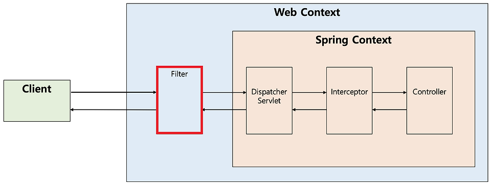
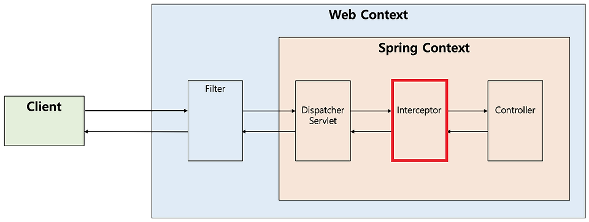

## Spring filter와 interceptor의 작동 방식과 사용 목적 차이

### 1. 들어가며
Spring 기반의 웹 애플리케이션을 개발하다 보면 요청과 응답을 가로채 특정 로직을 수행해야 하는 경우가 많습니다. 이러한 역할을 수행하는 대표적인 기능이 Filter와 Interceptor입니다.

이번 프로젝트를 진행할 때, 로그인 인증 부분을 개발하면서 Filter를 사용하게 되었습니다. 하지만 공부하는 도중 Filter와 Interceptor의 차이가 무엇이며, 어떤 상황에서 사용해야 하는지 궁금하여 블로그를 작성하게 되었습니다.

이 글에서는 Filter와 Interceptor의 개념과 차이점을 정리하고, 각각 언제 사용해야 하는지에 대해 알아보겠습니다.

<br>

### 2. Filter와 Interceptor의 개념과 동작 방식

Spring 웹 애플리케이션에서 클라이언트의 요청을 가로채는 대표적인 방법은 Filter와 Interceptor입니다. 이 두 가지는 요청을 처리하는 흐름을 제어할 수 있다는 공통점이 있지만, 동작하는 위치와 역할이 다릅니다.

**2.1 Filter란?**

Filter(필터)는 Java Servlet 스펙의 일부로, Servlet 컨테이너 레벨에서 HTTP 요청과 응답을 가로채 처리하는 역할을 합니다.

즉, 클라이언트에서 서버로 전달되는 요청(Request)과 서버에서 클라이언트로 보내는 응답(Response)에 대해 사전 또는 사후 작업을 수행할 수 있습니다.

Filter는 DispatcherServlet이 실행되기 전에 동작하기 때문에 Spring Context와는 독립적으로 작동하며, Spring이 아닌 일반 Java 웹 애플리케이션에서도 사용 가능합니다.



<br>

**[동작 방식]**

Filter는 Servlet 컨테이너 레벨에서 요청을 가로채고, 응답을 반환하기 전에도 개입할 수 있습니다.

1. 클라이언트가 요청을 보냄
2. 요청이 Filter에 의해 가로채짐
3. Filter에서 필요한 사전 처리 수행(예: 인코딩 설정, 로깅)
4. Filter가 FilterChain을 통해 요청을 DispatcherServlet 또는 다음 Filter로 전달
5. Controller에서 요청을 처리하고 응답 반환
6. Filter가 응답을 가로채 후처리 수행(예: 데이터 변환, 응답 로깅)
7. 클라이언트에게 최종 응답 전달

<br>

**2.2 Interceptor란?**

Interceptor(인터셉터)는 Spring Context에서 제공하는 기능으로, DispatcherServlet 이후 Controller로 요청이 전달되기 전/후에 특정 로직을 실행할 수 있습니다.

Filter와 달리 Spring Context 내부에서 동작하기 때문에 Spring의 다양한 기능(@Autowired, @Transactional 등)을 활용할 수 있으며, 요청의 본문(RequestBody)까지 조작이 가능합니다.



<br>

**[동작 방식]**

Interceptor는 HandlerInterceptor 인터페이스를 구현하여 사용하며, 아래의 세 가지 주요 메서드를 제공합니다.

```text
preHandle(): Controller 실행 전 요청을 가로채 처리할 로직 수행 
postHandle(): Controller 실행 후 응답이 생성되기 전에 실행
afterCompletion(): View 렌더링 후 최종적으로 실행되는 로직
```

1. 클라이언트가 요청을 보냄
2. DispatcherServlet이 요청을 Interceptor에게 전달
3. preHandle()이 실행됨
   - 여기서 false를 반환하면 요청이 중단됨
4. 요청이 Controller로 전달되고, 응답이 생성됨
5. postHandle()이 실행됨
6. View가 렌더링된 후 afterCompletion()이 실행됨

<br>

### 3. Filter와 Interceptor의 주요 코드 비교

Filter는 **Servlet 컨테이너에서 동작**하며, 모든 요청과 응답을 가로챕니다.  
Interceptor는 **Spring Context 내부에서 동작**하며, 컨트롤러 실행 전후에 개입할 수 있습니다.

<br>

**3.1 Filter의 동작 흐름**

Filter는 `javax.servlet.Filter` 인터페이스를 구현하여 사용합니다.  
`doFilter()` 메서드에서 요청을 가로채고, 이후 필터 체인을 통해 다음 필터 또는 Servlet으로 전달합니다.


#### **Filter 구현 예제**
```java
@WebFilter("/*") // 모든 요청에 적용
public class LoggingFilter implements Filter {

  @Override
  public void init(FilterConfig filterConfig) throws ServletException {
    System.out.println("Filter 초기화");
  }

  @Override
  public void doFilter(ServletRequest request, ServletResponse response, FilterChain chain)
    throws IOException, ServletException {
    HttpServletRequest httpRequest = (HttpServletRequest) request;
    String token = httpRequest.getHeader("Authorization");

    if (token != null && isValidToken(token)) {
      String userId = extractUserIdFromToken(token);
      request.setAttribute("userId", userId); // 사용자 정보 저장
    }

    System.out.println("요청이 Filter를 통과합니다.");
    chain.doFilter(request, response);
    System.out.println("응답이 Filter를 통과합니다.");
  }

  @Override
  public void destroy() {
    System.out.println("Filter 소멸");
  }

  private boolean isValidToken(String token) {
    return token.startsWith("Bearer "); // 간단한 예제 검증 (실제 구현에서는 JWT 검증 필요)
  }

  private String extractUserIdFromToken(String token) {
    return token.replace("Bearer ", ""); // 간단한 예제 (실제 구현에서는 JWT에서 사용자 ID 추출)
  }
}

```

**Filter의 주요 메서드**
1. `init()`:
   - Filter가 초기화될 때 한 번 호출됩니다.
   - 초기 설정을 하거나 리소스를 로드하는 데 사용됩니다.
   - 웹 컨테이너가 1회 init()을 호출하여 필터 객체를 초기화하면 이후 요청들은 doFilter()를 통해 처리한다.

2. `doFilter()`:
   - 요청이 들어올 때마다 실행되며, 요청 및 응답을 가로채 처리할 수 있습니다.
   - `chain.doFilter()`를 호출해야 다음 필터 또는 요청 핸들러(서블릿, 컨트롤러)로 요청이 전달됩니다.
   - url-pattern에 맞는 모든 HTTP 요청이 DispatcherServlet으로 전달되기 전에 웹 컨텡너에 의해 실행되는 메서드이다.

3. `destroy()`:
   - Filter가 소멸될 때 한 번 호출되며, 리소스 해제를 위한 정리 작업을 수행할 수 있습니다.
   - 웹 컨테이너가 1회 destroy()를 호출하여 필터 객체를 종료하면 이후에는 doFilter에 의해 처리되지 않는다.
  

<br>

**3.2 Interceptor의 동작 흐름**

Interceptor는 Spring Context의 HandlerInterceptor 인터페이스를 구현하여 Controller 실행 전/후의 요청을 가로챕니다.

**Interceptor 구현 예제**
```java
@Component
public class AuthInterceptor implements HandlerInterceptor {

  private static final ThreadLocal<String> userContext = new ThreadLocal<>();

  @Override
  public boolean preHandle(HttpServletRequest request, HttpServletResponse response, Object handler)
    throws Exception {
    System.out.println("Interceptor: Controller 실행 전");

    // Filter에서 저장한 userId 가져오기
    String userId = (String) request.getAttribute("userId");

    if (userId != null) {
      userContext.set(userId); // ThreadLocal에 사용자 정보 저장
      return true;
    }

    response.sendError(HttpServletResponse.SC_UNAUTHORIZED, "Unauthorized");
    return false; // 요청 중단
  }

  @Override
  public void postHandle(HttpServletRequest request, HttpServletResponse response, Object handler,
                         ModelAndView modelAndView) throws Exception {
    System.out.println("Interceptor: Controller 실행 후");
  }

  @Override
  public void afterCompletion(HttpServletRequest request, HttpServletResponse response,
                              Object handler, Exception ex) throws Exception {
    System.out.println("Interceptor: View 렌더링 완료 후");
    userContext.remove(); // ThreadLocal 정리 (메모리 누수 방지)
  }

  // 컨트롤러에서 사용자 정보를 가져올 수 있도록 하는 메서드
  public static String getCurrentUserId() {
    return userContext.get();
  }
}
```

**Interceptor의 주요 메서드**

1. `preHandle()`:
   - Controller 실행 전에 호출됩니다.
   - Controller 이전에 처리해야 하는 전처리 작업이나 요청 정보를 가공하거나 추가하는 경우에 사용할 수 있습니다.
   - true를 반환하면 요청이 계속 진행되며, false를 반환하면 요청이 중단됩니다.
2. `postHandle()`:
   - Controller 실행 후, View가 렌더링되기 전에 호출됩니다.
   - Model 데이터를 추가하거나 응답을 수정할 수 있습니다.
3. `afterCompletion()`:
   - View가 렌더링된 후 호출됩니다.
   - 모든 뷰에서 최종 결과를 생성하는 일을 포함해 모든 작어비 완료된 후에 실행됩니다.
   - 요청 처리 중에 사용한 리소스를 반환할 때 사용할 수 있습니다.

<br>

### 4. Filter와 Interceptor 정리

**4.1 Filter와 Interceptor 비교**

| 비교 항목        | Filter | Interceptor |
|-----------------|--------|-------------|
| **동작 위치**   | Servlet 컨테이너 (DispatcherServlet 이전) | Spring Context 레이어 (DispatcherServlet 이후) |
| **적용 대상**   | 모든 요청(Request, Response) | Controller 요청 및 응답 |
| **실행 시점**   | DispatcherServlet 실행 전/후 | Controller 실행 전/후, View 렌더링 전/후 |
| **RequestBody 접근** | ❌ 불가능 | ✅ 가능 |
| **응답(Response) 가로채기** | 가능 | 제한적 가능 (View 렌더링 전) |

<br>

**4.2 언제 Filter, Interceptor를 사용해야 할까?**

**Filter**는 서블릿 컨테이너에서 동작하며, 보안, CORS 설정, 인증, 권한 부여 등 전반적인 요청 흐름을 제어하는 데 적합합니다. 예를 들어, 해외 IP 차단, CORS 정책 적용, 요청/응답 로깅과 같은 작업을 수행할 수 있습니다. 

반면, **Interceptor**는 Spring Context 내에서 동작하며, 비즈니스 로직과 관련된 작업을 수행하는 데 적절합니다. 예를 들어, 사용자 세션 데이터 주입, 요청에 대한 권한 검증, 특정 API 호출 전에 추가적인 검증 로직 수행 등의 역할을 합니다.

### 5.마무리


필터와 인터셉터는 Spring 웹 개발에서 요청 흐름을 제어하는 중요한 요소입니다. 각각의 동작 위치와 목적을 이해하고 적절히 활용하면, 보다 효율적인 애플리케이션 설계가 가능합니다.

각각의 특성과 장점을 고려하여, 요구사항에 맞는 방식을 선택하는 것이 중요합니다. 이 글에서 설명한 내용을 바탕으로, 상황에 맞게 필터와 인터셉터를 활용하여 더 나은 Spring 웹 애플리케이션을 설계할 수 있습니다.
