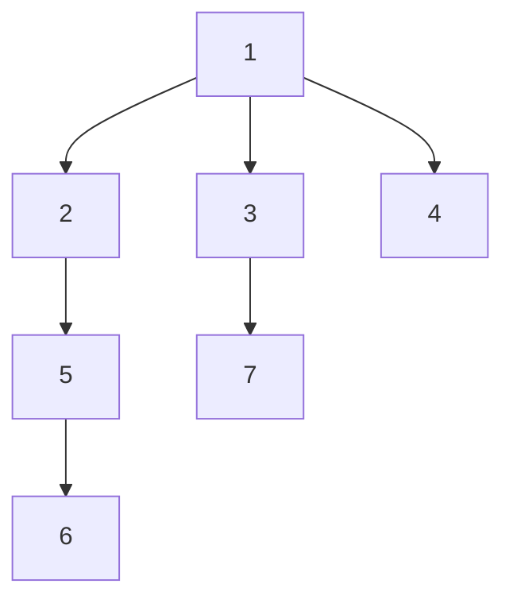

## 주제를 선정하게 된 배경
이번 프로젝트에서 MySQL을 사용하는 환경에서 계층형 구조의 게시판을 구현하고자 했습니다.

일반적으로 관계형 데이터베이스는 계층적인 데이터 구조를 표현하는 데 적합하지 않다고 알려져 있습니다.
하지만 프로젝트 기획상 하나의 프로젝트에는 여러 개의 단계가 존재하며, 각 단계별로 독립적인 게시판이 필요했습니다.
현재는 단계와 게시판을 별도로 관리하고 있지만, 향후에는 단계 자체도 게시판과 동일한 계층 구조로 확장할 가능성이 있다고 판단하여, 보다 유연한 계층 구조를 관리할 수 있도록 클로저 테이블(Closure Table) 방식을 도입하게 되었습니다.

관계형 데이터베이스에서 계층 구조를 다루는 방법에는 여러 가지가 있으며, 클로저 테이블은 특히 계층 전체를 빠르게 조회할 수 있는 장점이 있습니다.
저는 이 방식을 활용하여 계층 구조를 효과적으로 구현할 수 있었고, 이를 정리하면서 클로저 테이블뿐만 아니라 다른 계층형 데이터 모델링 방식도 함께 비교하고자 본 주제를 선정하게 되었습니다.

## 계층형 데이터 모델링 방법
계층형 데이터 모델링 방법에는 4가지 방법이 있습니다. 먼저 이 방법들에 대해서 간단히 소개한 뒤 클로저 테이블의 구조에 대해서 더 설명하고자 합니다.

### 1. Adjacency List (부모-자식 관계 방식)
 - parent_id 를 사용해서 계층 구조를 표현하는 가장 쉬운 방법으로,
 - 부모 id를 저장하여 어떤 데이터 밑에 있는 데이터인지 알 수 있습니다.
 - 장점 : 이해하기 쉽고 간단하다.
 - 단점 : 특정 노드의 조상이나 후손을 찾는 쿼리가 비효율적이다.
   
### 2. Materialized Path (경로 저장 방식)
 - 경로를 문자열 형태로 저장하는 방식입니다.
 - 예를 들어, '1/3/8/15' 처럼 특정 기호를 기준으로 경로를 구분할 수 있습니다.
 - 장점 : 조상-자식 관계의 조회가 빠르다.
 - 단점 : 노드 이동이 어렵고, 전체 경로 업데이트가 필요하다.

### 3. Nested Set (중첩 집합 모델)
 - left, right 값을 이용하여 트리를 표현하는 방식입니다.
 - 장점 : 특정 노드의 모든 자식을 한 번의 쿼리로 가져올 수 있다.
 - 단점 : 삽입/삭제 시 구조를 재계산 해야 하므로 성능이 저하될 수 있다.


### 4. Closure Table (클로저 테이블)
 - 트리의 모든 경로를 별도의 테이블로 저장하는 방식입니다.
 - 장점 : 특정 노드의 모든 조상/후손을 빠르게 조회할 수 있고, 재귀 쿼리 없이 효율적으로 트리 데이터를 가져올 수 있다.
 - 단점 : 데이터 저장 공간이 추가로 필요하며, 삽입이나 삭제 시 추가적인 데이터 입력이 필요하다.

### ※ 클로저 테이블 적용 시 고려사항
 - 일반적으로 클로저 테이블의 단점 중 하나는 **삽입 및 삭제 시 추가 연산이 필요**하다는 점입니다. 
 - 게시판은 데이터가 삭제되지 않고 무한히 추가되는 경우가 많기 때문에 이 단점이 크게 문제되지 않을 것으로 판단했습니다.
 - 따라서 삭제보다는 추가 작업이 더 많은 점을 고려해서 클로저 테이블 방식이 적합하다고 판단했습니다.

## 클로저 테이블의 테이블 구조
클로저 테이블의 구조는 다음의 4가지 값으로 구성되어야 합니다.
1. id (PK)
2. ancestor_id (조상)
3. descendant_id (자손)
4. depth

```SQL
CREATE TABLE closure_table (
    ancestor_id INT NOT NULL,
    descendant_id INT NOT NULL,
    depth INT NOT NULL,
    PRIMARY KEY (ancestor_id, descendant_id),
    FOREIGN KEY (ancestor_id) REFERENCES tree_node(id),
    FOREIGN KEY (descendant_id) REFERENCES tree_node(id)
);
```

만약 아래와 같이 클로저 테이블이 형성되어 있을 때, 이를 트리 구조로 만들면 아래의 그림과 같습니다.

| id | ancestor_id | descendant_id | depth |
|:--:|:-----------:|:-------------:|:-----:|
| 1  |      1      |       1       |   0   |
| 2  |      1      |       2       |   1   |
| 3  |      1      |       3       |   1   |
| 4  |      1      |       4       |   1   |
| 5  |      1      |       5       |   2   |
| 6  |      1      |       6       |   3   |
| 7  |      1      |       7       |   2   |
| 8  |      2      |       2       |   0   |
| 9  |      2      |       5       |   1   |
| 10 |      2      |       6       |   2   |
| 11 |      3      |       3       |   0   |
| 12 |      3      |       7       |   1   |
| 13 |      4      |       4       |   0   |
| 14 |      5      |       5       |   0   |
| 15 |      5      |       6       |   1   |
| 15 |      6      |       6       |   0   |
| 15 |      7      |       7       |   0   |


## 클로저 테이블 활용
노드를 추가하고 조회하는 방법을 예시 쿼리문을 통해 알아보고자 합니다.

### 1. 노드 추가
```SQL
INSERT INTO closure_table (ancestor_id, descendant_id, depth)
SELECT ancestor_id, 10, depth + 1 FROM closure_table WHERE descendant_id = 5
UNION ALL
SELECT 10, 10, 0;
```
위 쿼리문은 기존 5번의 노드 조상 정보를 가져와서 10번 노드에도 동일한 계층 관계를 추가하고, 새롭게 추가된 10번 노드에 자기 자신과의 관계도 설정하는 쿼리문입니다.

즉, 기존의 트리 구조를 유지하면서 새로운 자식 노드(10번 노드)를 추가하는 방식입니다.

### 2. 특정 노드의 모든 조상 조회
```SQL
SELECT ancestor_id FROM closure_table WHERE descendant_id = 10;
```
10번 노드의 모든 조상 노드 정보를 조회하는 쿼리문입니다. 이를 통해 루트 노드를 포함한 전체 경로를 가져올 수 있습니다.

### 3. 특정 노드의 모든 후손 조회
```SQL
SELECT descendant_id FROM closure_table WHERE ancestor_id = 3;
```
3번 노드의 모든 후손들을 조회하는 쿼리문입니다. 트리의 구조를 유지하면서 전체 하위 계층을 조회할 수 있습니다.
