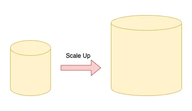
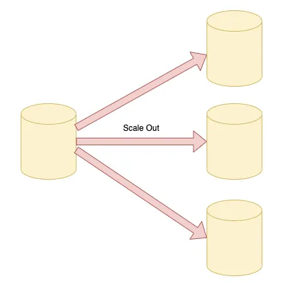
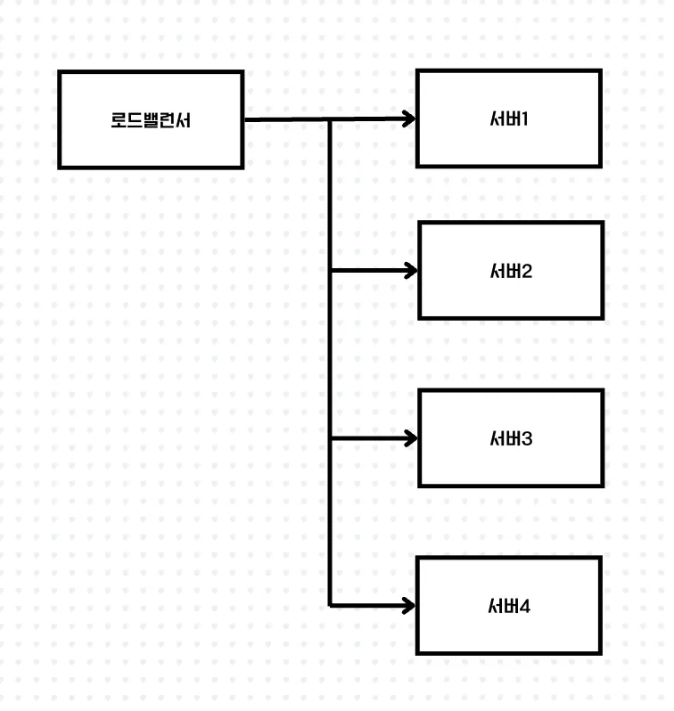
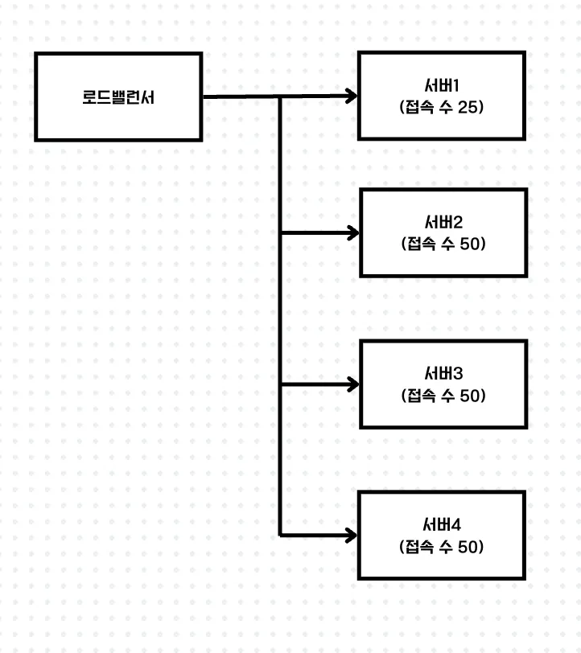

## 스케일 업 vs 스케일 아웃

**스케일 업은 쉽게 말하면 기존의 서버를 보다 높은 사양으로 업그레이드**하는 것을 말합니다. 하드웨어적인 예를 들면, 성능이나 용량 증강을 목적으로 하나의 서버에 디스크를 추가하거나 CPU나 메모리를 업그레이드시키는 것을 말합니다. AWS의 EC2 인스턴스 사양을 micro에서 small, small에서 medium등으로 높이는 것으로 생각하면 됩니다.

스케일 업은 스케일 아웃보다 관리 비용이나 운영이슈가 적고, 사양만 올리면 되는 것이기 때문에 비교적 쉽습니다.

하지만, 성능 향상에 한계가 있으며 성능 향상에 따른 비용부담이 크고 서버 한 대가 부담하는 양이 많아서 자연재해 등의 다양한 이유로 서버에 문제가 생기면 큰 타격을 입게 됩니다.

스케일 아웃은 장비를 추가해서 확장하는 방식을 말합니다. 기존 서버만으로 용량이나 성능의 한계에 도달했을 때, **비슷한 사양의 서버를 추가로 연결해** 처리할 수 있는 데이터 용량이 증가할 뿐만 아니라 기존 서버의 부하를 분담해 성능 향상의 효과를 기대할 수 있습니다.

또, 스케일업과 다르게 한대의 서버가 다운되더라도 나머지 서버들이 운용해주며 필요한 만큼 늘릴 수 있어 확장에 대한 제약사항이 스케일업에 비해 없는 편입니다.

다만, 여러 서버가 존재하기 때문에 데이터 일관성이 중요하며 아키텍처 및 데이터 관리에 대해 고민해야할 필요가 있습니다.

**서버가 여러 대로 나뉘기 때문에 각 서버에 걸리는 부하를 균등하게 해주는 ‘로드밸런싱’이 필수적으로 동반**되어야합니다.

따라서, 저희 테크돔 팀은 서버가 다운되더라도 나머지 서버들이 운용해주며 필요한 만큼 늘릴 수 있어 확장에 대한 제약사항이 스케일업에 비해 없으며 AWS의 AutoScaling 기술로도 지원이 되기때문에 스케일 아웃을 하기로 결정하였습니다.

다음 챕터에서는 로드밸런싱이 무엇인지, AWS에서 제공하는 로드밸런서의 종류에 대해 알아보는 시간을 가져보겠습니다.

## 부하 분산을 위한 로드밸런서, AWS 로드밸런서의 종류

로드밸런서는 여러 서버나 컴퓨터 자원에 작업을 고르게 분산하여 처리하는 것을 말합니다. 트래픽이 과도하게 몰려 서비스가 중단되는 일을 막고 지연없이 작업을 처리합니다.

로드밸런서의 종류로는 크게 L4 로드밸런서, L7 로드밸런서가 있습니다.

L4 로드밸런서는 주로 TCP/UDP요청을 기반으로 트래픽을 분산시키기 때문에 네트워크 계층에서의 로드밸런싱을 제공합니다. 그래서 단순하고 빠른 처리가 가능하지만 패킷의 안쪽 내용까지는 볼 수 없기 때문에 내용에 대한 깊은 작업은 제한적입니다. 따라서, 실시간 스트리밍, 화상 회의, 채팅 앱과 같이 빠른 응답과 안정적인 연결이 필요한 서비스에 적합합니다.

L7 로드밸런서는 응용프로그램 계층에서 작동하며, 패킷의 안쪽 내용까지 확인 후 로드밸런싱을 할 수 있기 때문에 URI, HTTP헤더, 쿠키, 세션 정보 등을 기반으로 트래픽을 분산시킵니다. 따라서, 주로 웹 에플리케이션에 적합합니다. 또, 요청의 세부적인 사항을 두고 결제만 담당하는 서버, 회원가입만을 담당하는 서버 등으로 분리해서 가볍고 작은 여러개의 서비스에 적합합니다.

AWS 로드밸런서에는 NLB(Network Load Balancer), ALB(Application Load Balancer)가 있는데, 각각 NLB는 L4계층에서 동작하며, ALB는 L7계층에서 동작합니다.

저희 테크돔 프로젝트에서는 애뮬레이터에서 시동 on, 주기정보, off를 요청하고 있습니다. 향후, 서비스의 안정성을 고려해볼때, path별로 라우팅이 가능하며 패킷의 안쪽 내용까지 확인하는 L7로드밸런서가 적합하다고 판단하여 L7로드밸런서를 적용하였습니다.

로드밸런서에서의 분산 목적지 결정 방법에는

- 라운드 로빈
- 가중 라운드 로빈
- 최소 커넥션
- 가중 최소 커넥션

이 있습니다.

라운드 로빈을 사용한 경우, 기본적으로 특별히 아무것도 신경 쓰지 않고 분산 목적지 목록에 있는 순서대로 엑세스를 분산합니다. (서버1 → 서버2 → 서버3 → 서버4 → 서버 1 → 서버 2 …)

라운드로빈은 무척 간단하여 알기 쉬운 반면, 분산 목적지 서버의 상태를 고려하지 않기 때문에 어떠한 이유인지와 상관없이 일시적으로 부하가 높아진 서버로도 엑세스를 분산해버립니다.

가중 라운드로빈은 기본적으로 라운드로빈과 같은 방식이지만, 지정한 가중치에 따라 특정 분산 목적지에 많게 또는 적게 엑세스를 분산합니다. 예를 들어, ‘서버 1 : 서버 2 : 서버 3 : 서버 4 = 1 : 2 : 2 : 2’의 가중치인 경우 서버 2~4에는 서버1의 2배만큼의 엑세스를 분산시킵니다.

(서버1 → 서버2 → 서버3 → 서버4 → 서버2 → 서버3 → 서버4 … )

가중치의 기준은 서버의 스펙이 동일하지 않은 경우, 서버의 스펙에 따라 적절한 양의 처리를 부담시키기 위해 이용합니다.

최소 커넥션은 접속 수가 적은 서버에 엑세스를 분산합니다. 예를 들면, 각 서버에 아래와 같이 접속되어있는 상황이라고 가정해봅시다.

이 경우, 최소 커넥션에서는 서버1에 우선적으로 엑세스를 분산합니다. 이와 같은 접속 수의 상황에서 가중 최소 커넥션이 ‘서버 1 : 서버 2 : 서버 3 : 서버 4 = 1 : 2 : 2 : 2’라고 한다면, 이 경우에는, 4개의 서버에 동일한 확률로 엑세스가 분산됩니다.

ALB(Application Load Balancer)은 라운드 로빈으로 분산 목적지를 결정합니다.

분산 목적지를 결정할 때, 목적지 서버가 응답하지 않는 상황이라면 목적지 목록에서 빼고 싶을 것입니다.

대부분의 로드밸런서에는 헬스체크(Health Check) 기능이 있는데 이것은 일정 간격으로 분산 목적지의 응답여부를 확인하여 응답이 없는 분산 목적지를 제외하는 기능이 있습니다.
