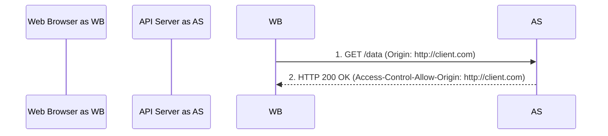
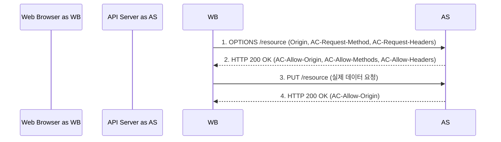

## CORS 에러, 이제 두렵지 않다! (원리부터 Spring Boot 해결까지)

안녕하세요! 웹 개발 여정에서 우리를 종종 멈칫하게 만드는 **CORS(Cross-Origin Resource Sharing) 에러**. API는 멀쩡한데 브라우저 콘솔에 빨간 불이 들어오면 당황스럽기 마련이죠. 😥

프론트엔드와 백엔드가 분리된 현대 웹 아키텍처에서는 다른 출처(Origin) 간의 통신이 필수적입니다. 하지만 브라우저의 보안 정책인 **SOP(Same-Origin Policy)** 때문에 이 과정이 기본적으로 차단됩니다. 바로 이 지점에서 CORS가 등장합니다!

이 글에서는 **CORS 에러가 왜 발생하는지(SOP)**, **CORS는 어떻게 동작하는지(주요 시나리오)**, 그리고 **스프링 부트(Spring Boot) 환경에서 CORS 문제를 어떻게 해결하는지** 핵심만 쏙쏙 뽑아 정리했습니다. 이 글을 통해 CORS에 대한 막연한 두려움을 떨쳐내시길 바랍니다!

## 목차

1.  **문제의 시작: SOP (Same-Origin Policy)**
  *   "출처(Origin)"란 무엇일까요?
  *   SOP 정책이란?
2.  **해결책 등장! CORS (Cross-Origin Resource Sharing)**
3.  **CORS의 주요 작동 방식**
  *   단순 요청 (Simple Request)
  *   예비 요청 (Preflight Request)
  *   인증된 요청 (Credentialed Request)
4.  **Spring Boot에서 CORS 설정하기**
  *   `@CrossOrigin` 어노테이션 (간편 설정)
  *   `WebMvcConfigurer` (전역 설정 - 권장 👍)
5.  **핵심 요약 & CORS 에러 대처 팁!**

---

## 1. 문제의 시작: SOP (Same-Origin Policy)

CORS를 이해하기 위한 첫걸음은 바로 **SOP(Same-Origin Policy, 동일 출처 정책)**입니다.

### "출처(Origin)"란 무엇일까요?

웹에서 '출처'는 다음 세 가지 요소의 조합으로 결정됩니다.

| 요소       | 설명                                                     | 예시                        |
| :--------- | :------------------------------------------------------- | :-------------------------- |
| **프로토콜** | 통신 규약                                                | `http`, `https`             |
| **호스트**   | 웹 서버의 주소 (도메인 또는 IP)                            | `www.example.com`, `localhost` |
| **포트**     | 통신에 사용되는 번호 (http: 80, https: 443은 보통 생략) | `80`, `443`, `3000`, `8080` |

이 세 가지가 **모두 일치해야** 브라우저는 "같은 출처"라고 판단합니다.

> ** 잠깐! 퀴즈 타임 🧐 **
> `http://localhost` 와 동일한 출처를 골라주세요!
>
> 1.  `http://127.0.0.1`
> 2.  `http://localhost/api/cors`
> 3.  `http://localhost:80`
> 4.  `https://localhost`
>
> (정답은 글 마지막에 공개!)

### SOP 정책이란?

SOP는 웹 브라우저의 **핵심적인 보안 기능**으로, **"다른 출처의 리소스에 대한 접근을 기본적으로 제한"**하는 정책입니다.

*   **왜 필요한가요?** 🛡️ **보안!** 만약 악의적인 웹사이트가 여러분이 로그인한 은행 사이트의 정보를 마음대로 가져갈 수 있다면 큰일이겠죠? SOP는 이런 위험을 막는 기본적인 방어선입니다.
*   **무엇을 막나요?** 주로 스크립트(JavaScript)를 이용한 다른 출처의 리소스 접근을 막으며, 특히 **다른 출처로 HTTP 요청(Ajax, fetch 등)을 보내고 그 응답을 읽는 것을 제한**하는 것이 CORS와 직접적인 관련이 있습니다.

> **💡 중요 포인트!**
> SOP는 서버의 물리적 위치가 아닌, **Origin(프로토콜, 호스트, 포트)의 동일성**으로 판단합니다. 따라서 같은 서버 내에서도 프론트엔드 포트와 API 서버 포트가 다르면 다른 출처로 간주되어 SOP의 영향을 받습니다.

---

## 2. 해결책 등장! CORS (Cross-Origin Resource Sharing)

SOP는 중요하지만, 프론트엔드와 백엔드 API 서버를 분리하는 현대 웹 개발에서는 다른 출처 간 통신이 필수적입니다. 이때 등장하는 해결사가 바로 **CORS(Cross-Origin Resource Sharing)**입니다!

*   **CORS란?** SOP의 보안 원칙은 지키면서, **안전하게 다른 출처와 자원을 공유**하기 위한 **W3C 표준**입니다.
*   **핵심 원리:** **서버**가 특정 **HTTP 응답 헤더**(`Access-Control-Allow-*` 등)를 통해 **브라우저**에게 "이 출처에서 오는 요청은 내가 허용했으니 안전해!"라고 명시적으로 알려주는 방식입니다.

> **🚨 꼭 기억하세요!**
> CORS는 **웹 브라우저에 적용되는 보안 메커니즘**입니다. **서버 간의 직접적인 통신에는 CORS가 적용되지 않습니다.** (Postman 등에서 API 테스트 시 CORS 에러가 없는 이유도 이 때문입니다!)

---

## 3. CORS의 주요 작동 방식

CORS는 요청의 특성에 따라 크게 세 가지 주요 방식으로 동작합니다.

### 가. 단순 요청 (Simple Request)

특정 조건을 만족하는 간단한 요청은 **Preflight 요청 없이 바로 서버로 전송**됩니다.

*   **조건:**
  *   HTTP 메서드: `GET`, `HEAD`, `POST` 중 하나
  *   `POST` 요청 시 `Content-Type`: `application/x-www-form-urlencoded`, `multipart/form-data`, `text/plain` 중 하나
  *   요청 헤더: 특정 기본 헤더 외 커스텀 헤더 없음
*   **흐름:**
  1.  **브라우저 -> 서버:** 실제 요청 전송 (요청 헤더에 `Origin` 포함)
  2.  **서버 -> 브라우저:** 응답 전송 (응답 헤더에 **`Access-Control-Allow-Origin: [허용할 출처]`** 포함)



### 나. 예비 요청 (Preflight Request)

단순 요청 조건을 만족하지 않는 경우 (e.g., `PUT`, `DELETE` 메서드, `Content-Type: application/json`, 커스텀 헤더 `Authorization` 포함 등), 브라우저는 실제 요청을 보내기 전에 **먼저 `OPTIONS` 메서드로 "예비 요청(Preflight Request)"**을 보냅니다.

*   **흐름:**
  1.  **브라우저 -> 서버 (Preflight 요청):** `OPTIONS` 메서드
    *   헤더: `Origin`, `Access-Control-Request-Method`, `Access-Control-Request-Headers`
  2.  **서버 -> 브라우저 (Preflight 응답):** `200 OK`
    *   헤더: `Access-Control-Allow-Origin`, `Access-Control-Allow-Methods`, `Access-Control-Allow-Headers`, `Access-Control-Max-Age` (Optional)
  3.  **브라우저 -> 서버 (실제 요청):** Preflight 응답이 성공적이면, 원래 보내려던 실제 요청 전송


> 만약 Preflight 응답에 적절한 `Access-Control-Allow-*` 헤더가 없으면, 브라우저는 실제 요청을 보내지 않고 바로 CORS 에러를 발생시킵니다!

### 다. 인증된 요청 (Credentialed Request)

요청에 **자격 증명 정보(쿠키, `Authorization` 헤더 등)를 포함**하는 경우입니다.

*   **다른 출처로 자격 증명을 보내기 위한 조건:**
  1.  **클라이언트 측:** 요청 시 `credentials: 'include'` (fetch API) 또는 `xhr.withCredentials = true` (XMLHttpRequest) 와 같이 명시적으로 설정해야 합니다.
  2.  **서버 측 응답 헤더:**
    *   **`Access-Control-Allow-Credentials: true`** 가 **반드시** 포함되어야 합니다.
    *   **`Access-Control-Allow-Origin`** 헤더에는 **와일드카드(`*`)를 사용할 수 없고, 요청을 보낸 특정 출처를 정확히 명시**해야 합니다. (보안상의 이유)

이 조건 중 하나라도 만족하지 않으면, 브라우저는 자격 증명을 보내지 않거나 서버 응답을 거부합니다.

---

## 4. Spring Boot에서 CORS 설정하기

스프링 부트 백엔드에서는 CORS 응답 헤더를 어떻게 설정할 수 있을까요? 대표적인 두 가지 방법을 소개합니다.

### 가. `@CrossOrigin` 어노테이션 (간편 설정)

Controller 클래스나 특정 핸들러 메서드 위에 `@CrossOrigin` 어노테이션을 붙여 간단하게 설정할 수 있습니다.

```java
// 1. Controller 전체에 적용
@CrossOrigin(origins = "http://localhost:3000") // localhost:3000 출처만 허용
@RestController
@RequestMapping("/api/items")
public class ItemController {
    // ...
}

// 2. 특정 메서드에만 적용 + 추가 설정
@RestController
@RequestMapping("/api/users")
public class UserController {
    @CrossOrigin(origins = {"http://localhost:3000", "https://my-app.com"}, // 여러 출처 허용
                 methods = {RequestMethod.GET, RequestMethod.POST}, // 특정 메서드만 허용
                 maxAge = 3600) // Preflight 캐시 1시간
    @GetMapping("/{id}")
    public User getUser(@PathVariable Long id) {
        // ...
    }
}
```

*   **장점:** 매우 간편하고 직관적입니다.
*   **단점:** 설정이 여러 곳에 흩어질 수 있어, 프로젝트가 커지면 관리가 어려울 수 있습니다.

### 나. `WebMvcConfigurer` (전역 설정 - 권장 👍)

CORS 설정을 한 곳에서 중앙 관리하는 **권장 방식**입니다.

```java
import org.springframework.context.annotation.Configuration;
import org.springframework.web.servlet.config.annotation.CorsRegistry;
import org.springframework.web.servlet.config.annotation.WebMvcConfigurer;

@Configuration
public class WebConfig implements WebMvcConfigurer {

    @Override
    public void addCorsMappings(CorsRegistry registry) {
        registry.addMapping("/api/**") // "/api/"로 시작하는 모든 경로에 적용
                .allowedOrigins("http://localhost:3000", "https://my-app.com") // 허용할 출처 목록
                .allowedMethods("GET", "POST", "PUT", "DELETE", "OPTIONS") // 허용할 HTTP 메서드
                .allowedHeaders("*") // 모든 요청 헤더 허용 (보안상 필요시 명시적으로 지정 권장)
                .allowCredentials(true) // [중요!] 쿠키/인증 헤더 포함 요청 허용 여부
                .maxAge(3600); // Preflight 응답 캐시 시간 (초)
    }
}
```

*   **`allowCredentials(true)`**: [매우 중요!] 쿠키나 `Authorization` 헤더 등 **자격 증명을 포함하는 요청을 허용**하려면 반드시 `true`로 설정해야 합니다. 이 경우, 보안 정책상 `allowedOrigins()`에 와일드카드(`*`)를 사용할 수 없고, **특정 출처를 명시**해야 합니다.

---

## 5. 핵심 요약 & CORS 에러 대처 팁!

마지막으로 핵심 내용을 다시 한번 정리해 드릴게요!

1.  브라우저의 **SOP**가 보안을 위해 다른 출처 요청을 기본적으로 막습니다.
2.  **CORS**는 서버가 **응답 헤더(`Access-Control-Allow-*`)**로 허용 정책을 알려주어, **브라우저가** 다른 출처 요청을 안전하게 허용하도록 하는 W3C 표준입니다.
3.  스프링 부트에서는 `@CrossOrigin` 어노테이션 또는 **`WebMvcConfigurer` (권장)**를 사용하여 **서버에 CORS 정책을 설정**함으로써 CORS 에러를 해결할 수 있습니다.

> **🚨 CORS 에러 발생 시 대처 꿀팁! 🍯**
>
> 1.  당황하지 말고! 서버 로그가 아니라, **브라우저 개발자 도구(F12)의 [네트워크(Network)] 탭**을 먼저 확인하세요!
> 2.  [네트워크] 탭에서 실패한 요청, 특히 **`OPTIONS` (Preflight) 요청**을 찾아서 **[응답 헤더(Response Headers)]**를 꼼꼼히 살펴보세요.
      >     *   `Access-Control-Allow-Origin` 헤더가 있는가?
>     *   그 값이 요청을 보낸 출처(`Origin` 요청 헤더 값)와 일치하는가? (또는 `*` 인가?)
>     *   `Access-Control-Allow-Methods`, `Access-Control-Allow-Headers`에 필요한 메서드/헤더가 포함되어 있는가?
>     *   인증된 요청이라면 `Access-Control-Allow-Credentials: true`가 있는가?
>
> 이 부분만 잘 확인해도 대부분의 CORS 문제는 원인을 찾고 해결할 수 있습니다!

---

이제 CORS 에러 앞에서 더 이상 당황하지 않고, 원리를 이해하며 차근차근 해결하실 수 있기를 바랍니다! 긴 글 읽어주셔서 감사합니다. 😊

> **퀴즈 정답:** 2번 (`http://localhost/api/cors`), 3번 (`http://localhost:80`)
