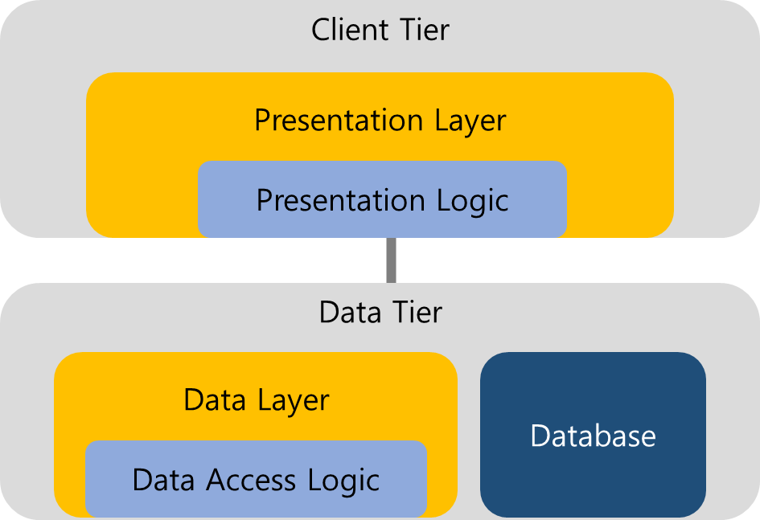
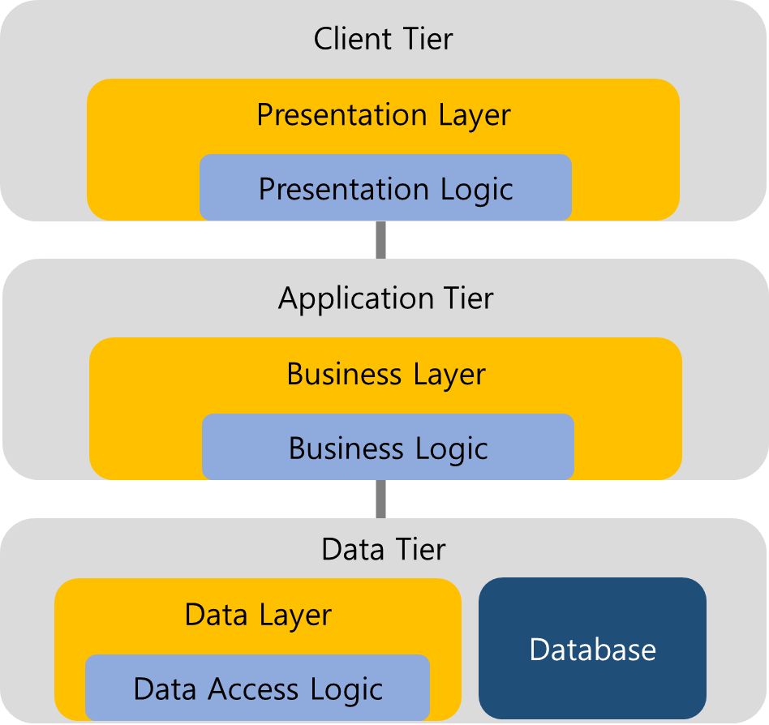
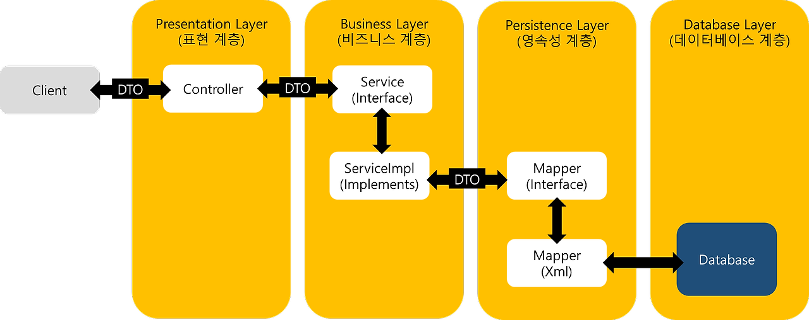
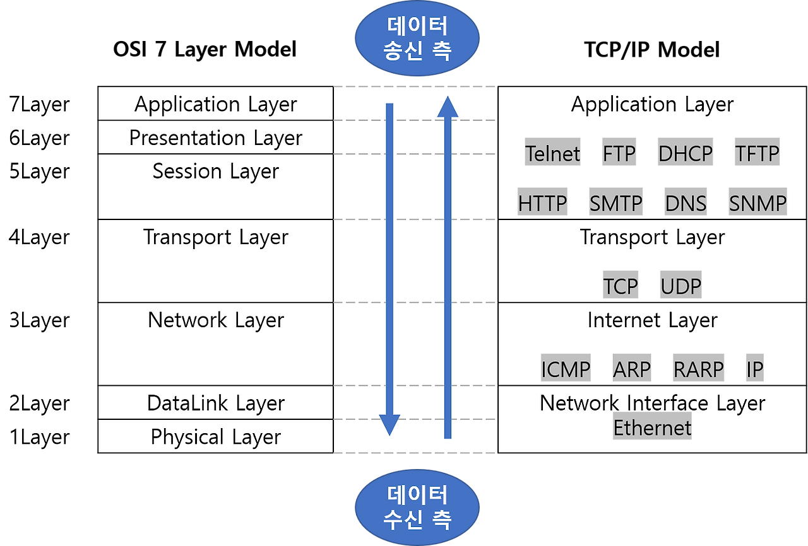

## 코린이의 소프트웨어 설계와 아키텍처 패턴 감 잡기
#### 부제: 우리는 어떤 뼈대 위에 코드를 쌓고 있는 걸까?

---

> **글을 쓰게 된 계기:**   
JPA를 공부하다가 영속 계층(Persistence Layer)에 흥미를 느끼면서  
“우리가 짜는 코드 구조의 근간은 뭘까?”라는 의문이 생겼습니다.

> **글을 쓰는 목표:**    
기능 구현도 벅찬 코린이에게 설계는 너무 먼 이야기일 수 있지만, 이번 시간의 목표는
그 질문을 따라 소프트웨어 설계, 아키텍처, 그리고 그 패턴들까지.. 개념은 들어봤다는 수준까지의 학습을 목표로 작성했습니다.

  

---

### ➡️ 소프트웨어 설계부터 개발까지, 패턴의 유용성

> 무작정 짓는 건물은 무너지기 쉽다.  
> 소프트웨어도 마찬가지다.

 
우리가 작성하는 수많은 코드에는 의도와 목적이 담겨 있고,  
그 목적에 따라 코드 간에는 책임, 역할, 관계가 생겨납니다.  

이처럼 여러 기능들이 상호작용하며 하나의 시스템(system)을 구성하고,  
이 시스템의 전체 구조를 계획하는 것을 소프트웨어 설계라고 부릅니다.
그러나 실제로 처음부터 구조를 다 떠올리며 개발하는 건 어려운 일입니다.    

하지만 다행히도 우리가 만들고자 하는 소프트웨어들은 유사한 특징들과 반복되는 패턴을 가지고 있고, 역할 및 책임에 따라 분리하는 객체지향적 프로그래밍이라는 개념이 등장했습니다. 덧붙여 이러한 사실들을 바탕으로 선배 개발자 분들의 각고의 노력으로 개발 족보를 만들어뒀다는 사실을 알고 계신가요?   

여기서 등장하는 것이 바로 소프트웨어 아키텍처 패턴 입니다. 아키텍처 패턴은 수많은 실무 사례에서 검증된 시스템 구조 설계 방식을 패턴화한 것입니다. 이제 소프트웨어 아키텍처 패턴을 공부해봅시다. 

  

---

### ➡️ 소프트웨어 아키텍처와 아키텍처 패턴까지 훑어보기

> 코딩하기 전에 설계해야 한다는 것은 동의한다.
> 그러면 설계는 쉽냐? 어렵다.

 
아차, 아키텍처 패턴이 무엇인지 알아보기 앞서 아키텍처가 무엇인지부터 이해해야 겠네요.  

‘아키텍처’는 원래 건축 용어지만, 소프트웨어 분야에서는  
**전체 시스템의 기본 구조와 컴포넌트 간 관계를 정의하는 설계 원칙**을 의미합니다.  

아키텍처는 소프트웨어 시스템의 토대에 해당하는 가장 기본이 되는 구조에 대한 개념으로, '전체 뼈대' 또는 '청사진'에 빗대어 설명하곤 합니다. 이는 마구잡이식 소프트웨어 설계를 예방해주는 첫 걸음이라 할 수 있으며, 소프트웨어 개발의 방향성과 목적성을 지켜주는 코드의 근간입니다.  

그리고 아키텍처 패턴은 소프트웨어 아키텍처 '패턴'이란, 소프트웨어(시스템)의 뼈대(구조)를 잡는 방식에 있어 좋다고 판단된 수많은 경험 사례들을 통해, 전형화된 설계 방식을 의미합니다. 즉, **수많은 실무 사례에서 검증된 시스템 구조 설계 방식**을 패턴화한 것입니다. 앞서서 제가 선배 개발자들의 개밸 족보가 있다고 했었죠? 이번 글의 주제니 다시 한번 언급해봅니다.  

- 대표적인 아키텍처 패턴
  -   Broker 패턴
  -   Client-Server 패턴
  -   State-Logic-Display(3-tier) 패턴
  -   Sense-Compute-Control 패턴
  -   Layer(ed) 패턴 : n-tear 패턴이라고도 불리며, 이는 코드의 역할에 따라 레이어로 분류하여 시스템을 설계한 형태이다.

 

---

### ➡️ 레이어드 패턴 (Layered Pattern) 만은 제대로 이해하고 싶다

 

여러 아키텍처 패턴에서도 자주 사용하고 비교적 익숙한 레이어드 패턴을 살펴봅시다. 계층화 패턴이라고도 부르는 이 아키텍처는 시스템을 여러 계층으로 나누어, 각 계층이 특정한 역할을 수행하도록 하는 소프트웨어 아키텍처 패턴의 한 종류입니다.   

레이어드 아키텍처의 주요 장점은 계층 간의 역할이 명확히 분리되어 있어, 시스템의 유지보수와 확장이 용이하다는 것입니다. 또한, 각 계층은 독립적으로 개발될 수 있으므로 팀 간의 협업에도 유리합니다.

> layer 1 (최상위 레이어)  
> layer 2  
> layer 3  
> ...  
> layer n (최하위 레이어)

 

- 레이어를 나누는 방식 
  ① 계층이 바로 아래에 있는 계층만 알고 있는 엄격한 방식 
  ② 계층이 그 아래에 있는 모든 계층에 액세스할 수 있는 보다 유연한 접근 방식
    
  CF. 마틴 파울러 (Martin Fowler)에 따르면, ②는 중간 계층에서 프록시 메소드나 완전한 프록시 클래스)의 생성을 피하고 라자냐 아키텍처의 안티 패턴으로 저하 될 수 있기 때문에 실제로 더 잘 작동된다고 말한다.

 

- 레이어와 티어의 차이
   아키텍처를 다룰 때, 티어(Tier)와 레이어(Layer)를 자주 언급하게 되는데, 이를 구분 없이 사용하는 경우가 있다. 하지만 티어는 물리적인 영역의 분리이고, 레이어는 논리적인 영역의 분리를 의미한다. 때문에 티어는 서비스에 필요한 영역을 서브넷을 기준으로 하여 물리적으로 서버가 구분되는 경우에 사용하고, 레이어는 논리적으로 역할을 구분하는 용도 등으로 사용4되므로 용어 사용에 유의할 필요가 있다.

 

- 레이어드 패턴 사용 시 유의할 점
  -   Layered Anti-pattern
  -   Architecture Sinkhole Anti-pattern : 이유없이 존재하는 레이어가 있는 경우
  -   Lasagna Architecture(라자냐 아키텍처) : 결국 계층이 너무 많아져 복잡해지고 전체 시스템의 성능이 저하되는 경우를 가리킨다.

  

---

### ➡️ 레이어드 패턴으로 어떤 구조를 짤 수 있을까

 

- 2계층 아키텍처 구조 (2-Tier Architecture)
  -   Presentation Layer (표현 계층)
  -   Data Layer (데이터 계층)

      
 

- 3계층 아키텍처 구조 (3-Tier Architecture) 
  -   Presentation Layer (표현 계층)
  -   Application Layer (응용 계층)
  -   Data Layer (데이터 계층)

      
 

- 4계층 아키텍처 구조 (4-Tier Architecture)
  -   Presentation Layer (표현 계층)
  -   Business Layer (비지니스 계층) 
  -   Persistence Layer (영속성 계층)
  -   Database Layer (데이터베이스 계층)

        
  

- 도메인 주도 설계 (Domain Driven Design)는 어려우니까 PASS..

  

- OSI 7계층 (OSI 7 Layer)

  : 네트워크 통신이 일어나는 과정을 7개의 계층으로 나눈 국제 표준화 기구(ISO)에서 정의한 네트워크 표준 모델로, 각 계층을 지날 때마다 각 계층에서 헤더가 붙이고 수신 측은 역 순으로 헤더를 분석하는 형식을 갖는다.   
  -   Application Layer (응용 계층)
  -   Presentation Layer (표현 계층)
  -   Session Layer (세션 계층)
  -   Transport Layer (전송 계층)
  -   Network Layer (네트워크 계층)
  -   DataLink Layer (데이터링크 계층)
  -   Physical Layer (물리 계층)

        
  

---

### ➡️ 디자인 패턴도 알아보자

 

패턴이라고 할 때 아키텍처 패턴보다 우리가 더 자주 듣는 용어인 디자인 패턴, 둘은 어떻게 다를까요? 이를 알아보기 앞서 우선 디자인 패턴을 학습해봅시다.   

디자인 패턴이란 한마디로 자주 발생하는 문제들에 대한 일반적인 해결책으로,  
설계 단계에서 만들어진 뼈대 안에서 코드를 어떻게 잘 작성할 것인가? 에 대한 문제를 도와줍니다. 이러한 디자인 패턴은 일반적인 프로그래밍 과정에서도 사용되지만 라이브러리나 프레임워크를 구성하는 데에도 사용됩니다.

  

>우리는 사실 디자인 패턴을 사용하지 않고도 그 문제를 해결할 수 있는데,  
디자인 패턴이 강력한 해결책으로 여겨지는 이유가 뭘까요?

- 재사용성 : 반복적인 문제에 대한 일반적인 해결책을 제공하므로, 이를 재사용하여 유사한 상황에서 코드를 더 쉽게 작성할 수 있다.
- 가독성 : 일정한 구조로 정리하고 명확하게 작성하여 개발자가 코드를 이해하고 유지보수하기 쉽게 만든다.
- 유지보수성 : 코드를 쉽게 모듈화 할 수 있으며, 변경이 필요한 경우 해당 모듈만 수정하여 유지보수가 쉬워진다.
- 확장성 : 새로운 기능을 추가하거나 변경할 때 디자인 패턴을 활용하여 기존 코드를 변경하지 않고도 새로운 기능을 통합할 수 있다.
- 안정성과 신뢰성 : 수많은 사람들이 인정한 모범 사례로 검증된 솔루션을 제공한다.

  

> 디자인 패턴의 분류와 종류 간단히 둘러보기

수많은 디자인 패턴들이 존재하지만 이들 중에서도 가장 유명한 GoF의 디자인 패턴에 등장하는 23가지 패턴에 대해서 간단히 알아봅시다. 디자인 패턴은 크게 생성(Creational), 구조(Structural), 그리고 행위(Behavioral) 패턴으로 분류되는데 이를 기반으로 살펴봅시다.

 

- 생성 패턴(Creational Pattern)
  - Singleton(싱글톤 패턴) : 하나의 클래스 인스턴스를 전역에서 접근 가능하게 하면서 해당 인스턴스가 한 번만 생성되도록 보장하는 패턴이다.
  - Factory Method(팩토리 메서드 패턴) : 객체를 생성하기 위한 인터페이스를 정의하고, 서브클래스에서 어떤 클래스의 인스턴스를 생성할지 결정하는 패턴이다.
  - Abstract Factory(추상 팩토리 패턴) : 관련된 객체들의 집합을 생성하는 인터페이스를 제공하며, 구체적인 팩토리 클래스를 통해 객체 생성을 추상화하는 패턴이다.
  - Builder(빌더 패턴) : 복잡한 객체의 생성 과정을 단순화하고, 객체를 단계적으로 생성하며 구성하는 패턴이다.
  - Prototype(프로토타입 패턴): 객체를 복제하여 새로운 객체를 생성하는 패턴으로, 기존 객체를 템플릿으로 사용하는 패턴이다.

 

- 구조 패턴(Structural Pattern)
  - Adapter(어댑터 패턴) : 인터페이스 호환성을 제공하지 않는 클래스를 사용하기 위해 래퍼(Wrapper)를 제공하는 패턴이다.
  - Bridge(브릿지 패턴) : 추상화와 구현을 분리하여 두 가지를 독립적으로 확장할 수 있는 패턴이다.
  - Composite(컴포지트 패턴) : 개별 객체와 복합 객체를 동일하게 다루어, 트리 구조의 객체를 구성하는 패턴이다.
  - Decorator(데코레이터 패턴) : 객체에 동적으로 새로운 기능을 추가하여 객체를 확장할 수 있는 패턴이다.
  - Facade(퍼사드 패턴) : 서브시스템을 더 쉽게 사용할 수 있도록 단순한 인터페이스를 제공하는 패턴이다.
  - Flyweight(플라이웨이트 패턴) : 공유 가능한 객체를 통해 메모리 사용을 최적화하는 패턴이다.
  - Proxy(프록시 패턴) : 다른 객체에 대한 대리자(Proxy)를 제공하여 접근 제어, 지연 로딩 등을 구현하는 패턴이다.

 

- 행위 패턴(Behavioral Pattern)
  - Observer(옵저버 패턴) : 객체 간의 일대다 종속 관계를 정의하여 한 객체의 상태 변경이 다른 객체들에게 알려지도록 한다.
  - Strategy(전략 패턴) : 알고리즘을 정의하고, 실행 중에 선택할 수 있게 한다.
  - Command(커맨드 패턴) : 요청을 객체로 캡슐화하여 요청을 매개변수화 하고, 요청을 큐에 저장하거나 로깅하고 실행을 지연시킨다.
  - State(상태 패턴) : 객체의 상태를 캡슐화하고, 상태 전환을 관리한다.
  - Chain of Responsibility(책임 연쇄 패턴) : 요청을 보내는 객체와 이를 처리하는 객체를 분리하여, 다양한 처리자 중 하나가 요청을 처리한다.
  - Visitor(방문자 패턴) : 객체 구조를 순회하면서 다양한 연산을 수행할 수 있게 한다.
  - Interpreter(인터프리터 패턴) : 언어나 문법에 대한 해석기를 제공하여, 주어진 언어로 표현된 문제를 해결하는 패턴이다.
  - Memento(메멘토 패턴) : 객체의 내부 상태를 저장하고 복원할 수 있는 기능을 제공하는 패턴이다.
  - Mediator(중재자 패턴) : 객체 간의 상호 작용을 캡슐화하여, 객체 간의 직접적인 통신을 방지하는 패턴이다.
  - Template Method(템플릿 메서드 패턴) : 알고리즘의 구조를 정의하면서 하위 클래스에서 각 단계의 구현을 제공하는 디자인 패턴이다.
  - Iterator(이터레이터 패턴) : 컬렉션 내의 요소들에 접근하는 방법을 표준화하여 컬렉션의 내부 구조에 독립적으로 접근할 수 있는 패턴이다.

  

---

➡️  소프트웨어 아키텍처 패턴과 디자인 패턴은 뭐가 다를까?

> 소프트웨어 아키텍처 패턴 >> 디자인 패턴

아키텍처, 디자인 패턴을 대략적으로 살펴봤으니 이제 둘은 어떻게 다른지 비교해봅시다. 디자인 패턴을 한문장으로 이해해보면, 코드의 특정 유형들을 정립하여 효율적인 방식을 패턴화한 것입니다. 이는 아키텍처 패턴과 유사해보이지만..  

아키텍처 패턴이 소프트웨어 시스템 설계와 관련된 것이었다면.... 디자인 패턴은 이보다 좁은 개념으로, 소프트웨어 내부를 구성하는 코드 자체와 관련된 족보라고 이해됩니다.  

둘을 표로 비교하면 아래처럼 나타낼 수 있겠네요.

| 항목 | 아키텍처 패턴 | 디자인 패턴 |
|------|----------------|--------------|
| 범위 | 시스템 전체 구조 | 코드 수준 문제 해결 |
| 적용 시점 | 설계 초기 | 설계 후 구현 단계 |
| 예시 | Layered, MVC, Broker | Singleton, Strategy, Observer 등 |

  

> 우리가 사용하는 MVC 패턴은 아키텍처 패턴인가, 아니면 디자인 패턴인가?

자바를 만든 sun 그리고 마이크로소프트 문서에서 디자인 패턴이라고 하고, MVC 패턴을 정의했다고 할 수 있는 POSA에서는 아키텍쳐 패턴이라고 나오는 등.. 논란이 좀 있기 때문에 위에서 포함시키지 않았는데요. 사실 특정 패턴에 대해 이것이 어디에 속하는지 보다는 구조와 이를 실제로 사용할 줄 아는 것이 더 중요하다고 생각됩니다.

  

---

### ➡️ 글을 마치며

언젠가 이 글을 보며 에이 이게 아닌데.. 할 수 있는 날이.. 나의 실력 그만큼 성장하길 기대하며 이번 주제에 대한 디깅에서는 여기까지 하겠습니다. 보강할 부분이나 틀린 부분은 절 찾아와주신다면 감동의 눈물을 흘릴 것 같습니다. 이상 코린이의 학습일지였습니다. 감사합니다. 

  

---

### ➡️ 참고 자료

\[아티클\]  
[https://www.nareshbhatia.dev/articles/domain-driven-design-6-layered-architecture](https://www.nareshbhatia.dev/articles/domain-driven-design-6-layered-architecture))

\[기술블로그\]  
[https://tech.kakao.com/2022/12/12/ddd-of-recommender-team/](https://tech.kakao.com/2022/12/12/ddd-of-recommender-team/)

\[동영상\]  
[https://www.youtube.com/watch?v=VHTc5Q2jyrY&list=PLXoD0q-W39YLypvv6vBGq4ZNm9wBL7Xox&index=2](https://www.youtube.com/watch?v=VHTc5Q2jyrY&list=PLXoD0q-W39YLypvv6vBGq4ZNm9wBL7Xox&index=2)  
[https://www.youtube.com/watch?v=4E1BHTvhB7Y](https://www.youtube.com/watch?v=4E1BHTvhB7Y) (마틴 파울러의 소프트웨어 아키텍처의 중요성)
